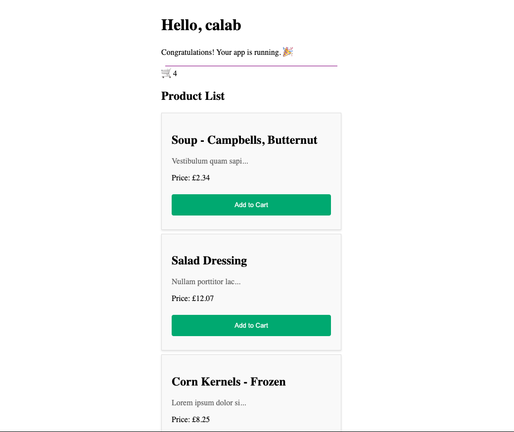

# Angular Signals Lab

## 1. Setup Project

### 1.1 Install Dependencies

1. Change directory to `calab`:

    ```.sh
    cd calab
    ```
2. Install dependencies by running the following command:

    ```.sh
    npm install
    ```
3. You should see a message in your Terminal confirming the npm packages were installed successfully:
    []() 

### 1.1 Start The Application

1. Start Angular Development Server if not yet started:

    ```.bash
    npx -p @angular/cli ng serve
    ```
    > _Otherwise refresh the browser tab to see updated view._

2. You should see the following getting rendered in your browser:

    []() 

    > _You should see similar view to where you left off in previous lab._

## 2. Move Cart Separate Component

### 2.1 Create A Cart Component

- Create a new Component called `Cart` using CLI:

    ```.sh
    npx -p @angular/cli ng generate component components/cart
    ```

### 2.1 Create A Cart Service

- Create a new Component called `Cart` using CLI:

    ```.sh
    npx -p @angular/cli ng generate service services/cart
    ```

### 2.2 Implement Signal Inside Cart Service
- Open `src/app/services/cart.service.ts` file and do the following:
    - Declate a writable signal and set its default value to empty list `[]`:

        ```.js
        currentCart = signal<Product[]>([]);
        ```

    - Inside `constructor` of `CartService`, call an `effect` and log the Signal value:

        ```.js
        constructor(){
            effect(() => {
                console.log(`The current car contains: ${this.currentCart()}`);
            });
        }
        ```

    - Inside `CartService`, just below constructor, declare `getCart` function:

        ```.js
        getCart(){
            return this.currentCart;
        }
        ```
    - Inside `CartService`, just below constructor, declare `addToCart` function that takes `Product` as a parameter:

        ```.js
        addToCart(product: Product){
            this.currentCart.update(list => {
                return [...list, product];
            })
        }
        ```


### 2.2 Inject CartService Into Cart Component

- Open `src/app/components/cart/cart.component.ts` file and do the following:
    - Declate a writable signal called `cartSignal`:

        ```.js
        cartSignal: Signal<Product[]>;
        ```

    - Inject `CartService` into CartComponents `constructor` and retrieve cart signal and assign it to the variable declared in previous step:

        ```.js
        constructor(private cartService: CartService){
            this.cartSignal = this.cartService.getCart();
        }
        ```
    - Inside `CartComponent`, just below constructor, declare `addToCart` function that takes `Product` as a parameter and sends it to `CartService`:

        ```.js
        public addToCart(product: Product){
            this.cartService.addToCart(product)
        }
        ```

- Open `src/app/components/cart/cart.component.html` and replace current HTML code with the following:

    ```.html
    @if (cartSignal().length > 0) {
        🛒 {{cartSignal().length}}
    } @else {
        🛒 Empty
    }
    ```

### 2.3 Remove Cart From Product List Component

- Open `src/app/components/product-list/product-list.component.ts` and do the following:
    - Inject `CartService` into producListComponents `constructor`:

        ```.js
        constructor(private productService: ProductService, private cartService: CartService) {}
        ```

    - Delete the following line since it's no longer needed:

        ```.js
        cart: Product[] = [];
        ```

    - Update the `addToCart()` method to call `CartService` instead of adding to previously declared list of Products:

        ```.js
        addToCart(product: Product) {
            this.cartService.addToCart(product);
        }
        ```
        
- Open `src/app/components/product-list/product-list.component.html` and remove the folling code:

    ```.html
    @if (cart.length > 0) {
        🛒 {{cart.length}}
    } @else {
        🛒 Empty
    }
    ```

### 2.3 Move Cart To App Component

- Open `src/app/app.component.ts` file and do the following:
    - Inside `src/app/app.component.ts` update `imports` to include `CartComponent`:

        ```.js
        imports: [RouterOutlet, ProductListComponent, CartComponent],
        ```

- Open `src/app/app.component.html` file and do the following:
    - Add the following element after the `<div class="divider"...`, to render `CartComponent`.
 
        ```.html
        <app-cart></app-cart>
        ```

### 5.3 Review Changes

1. Start Angular Development Server if not yet started:

    ```.bash
    npx -p @angular/cli ng serve  --host 0.0.0.0 
    ```
    > _Otherwise refresh the browser tab to see updated view._

2. You should see the following getting rendered in your browser:
    []() 
