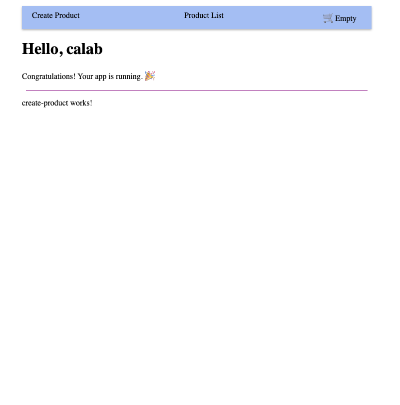

# Angular Routing Lab

## 1. Setup Project

### 1.1 Install Dependencies

1. Change directory to `calab`:

    ```.sh
    cd calab
    ```
2. Install dependencies by running the following command:

    ```.sh
    npm install
    ```
3. You should see a message in your Terminal confirming the npm packages were installed successfully:
    []() 

### 1.1 Start The Application

1. Start Angular Development Server if not yet started:

    ```.bash
    npx -p @angular/cli ng serve
    ```
    > _Otherwise refresh the browser tab to see updated view._

2. You should see the following getting rendered in your browser:

    []() 

    > _You should see similar view to where you left off in previous lab._

## 2. Create a new Component

### 2.1 Create A New Component Called CreateProduct

1. Create a new Component called `Cart` using CLI:

    ```.sh
    npx -p @angular/cli ng generate component components/create-product
    ```

## 3. Define and Use Your Routes

### 3.1 Define Routes In Routes Array

1. Open `src/app/app.routes.ts` file and do the following:
    - Import components that going to be used in router.

        ```.js
        import { CreateProductComponent } from './components/create-product/create-product.component';
        import { ProductListComponent } from './components/product-list/product-list.component';
        ```
    - Define each route as an JavaScript object and add it to `Routes` array:

        ```.js
        { path: 'create-product', component: CreateProductComponent },
        { path: 'product-list', component: ProductListComponent }
        ```

### 3.2 Use Defined Routs In an Application

1. Open `src/app/app.component.ts` file and do the following:
    - Import `RouterLink` from the `@angular/router`.
2. Open `src/app/app.component.html` file and do the following:
    - Just above `<h1>Hello, {{ title }}</h1>`, use a routerLink attributes to add routes to selected elements. Also move `<app-cart></app-cart>` to navigation bar as well.:

        ```.html
        <nav class="nav-bar">
            <ul>
                <li><a routerLink="/create-product" >Create Product</a></li>​
                <li><a routerLink="/product-list">Product List</a></li>​
                <li>
                    <app-cart></app-cart>
                </li>
            </ul>
        </nav>
        ```
    - Move `<router-outlet />` from bottom of the file to just below `<div class="divider"...` .
        ```.html
        <div class="divider" role="separator" aria-label="Divider"></div>
        <router-outlet />
        ```
3. Open `src/app/app.component.css` file and do the following styling for Navigation bar:
    ```.css
    .nav-bar {
        background-color: #a8bef5;
        padding: 10px;
        box-shadow: 0 2px 4px rgba(0, 0, 0, 0.3);
    }
    
    .nav-bar ul {
        list-style: none;
        margin: 0;
        padding: 0;
        display: flex;
        justify-content: space-between;
    }
    
    .nav-bar li {
        margin-right: 20px;
    }
    
    .nav-bar a {
        color: #000000;
        padding: 10px;
        text-decoration: none;
    }
    
    .nav-bar a:hover {
        color: #8a7878;
    }
    ```

### 3.3 Review Changes

1. Start Angular Development Server if not yet started:

    ```.bash
    npx -p @angular/cli ng serve 
    ```
    > _Otherwise refresh the browser tab to see updated view._

2. You should see the following getting rendered in your browser:
    []() 